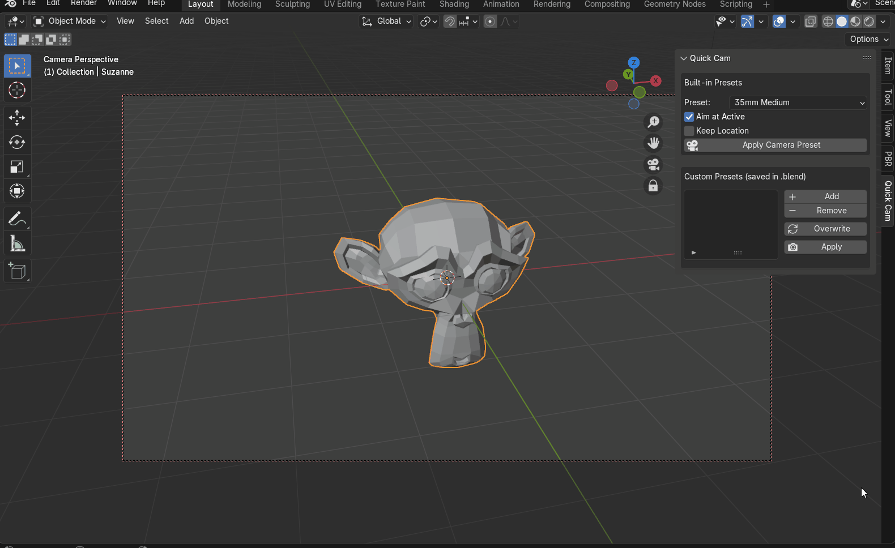

# Quick Camera Presets Switcher

A simple Blender add-on that lets you apply and manage camera presets with a single click.  
Switch between common cinematography lenses, isometric, or top-down views instantly, and create your own custom presets stored inside your `.blend` file.

---

## Features

- **Built-in Presets**  
  -  35mm Medium  
  -  50mm Portrait  
  -  85mm Close-Up  
  -  Isometric (Ortho)  
  -  Top-Down (Ortho)  

- **Custom Presets**  
  - Save the **current scene camera** as a preset.  
  - Rename presets to keep your project organized.  
  - Update/overwrite a preset with the current camera.  
  - Apply presets back to the scene camera.  
  - All custom presets are saved **within the .blend project** (no external files needed).  

- **Extras**  
  - Option to automatically aim the camera at the active object.  
  - Option to keep current camera location while only changing lens/rotation.

---

## Installation

1. Download the Python file `quick_camera_presets_switcher.py`.
2. Open Blender → **Edit > Preferences > Add-ons**.
3. Click **Install...** and select the `.py` file.
4. Enable the add-on by checking the box.
5. Open the **3D Viewport > N (Sidebar) > Quick Cam** tab.

---

## Usage

### Built-in Presets
1. Choose a preset from the dropdown.  
2. Toggle:
   - **Aim at Active** → camera points to the active object.  
   - **Keep Location** → keeps the camera where it is, only changes settings.  
3. Press **Apply Camera Preset**.

### Custom Presets
1. Position your scene camera as desired.  
2. In the **Custom Presets** panel:  
   - Click **Add** to save the current camera.  
   - Select a preset from the list to rename it.  
   - Click **Capture From Current** to overwrite it with the current camera.  
   - Click **Apply** to use it.  
   - Click **Remove** to delete it.  

All changes are stored in the `.blend` file — no external config needed.

---

## Screenshots

---

## Requirements

- Blender 3.0 or newer

